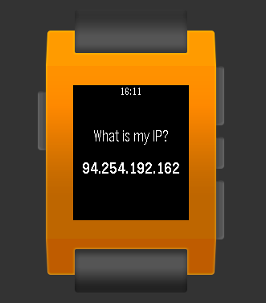

# pebble-what-is-my-ip

> Simple application display IP address of Pebble device.

## Help links

* https://developer.pebble.com/tutorials/pebble-js-tutorial/part1/
* https://developer.pebble.com/blog/2013/07/24/Using-Pebble-System-Fonts/
